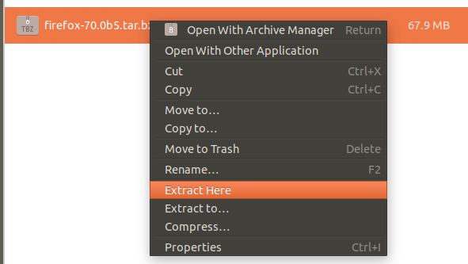
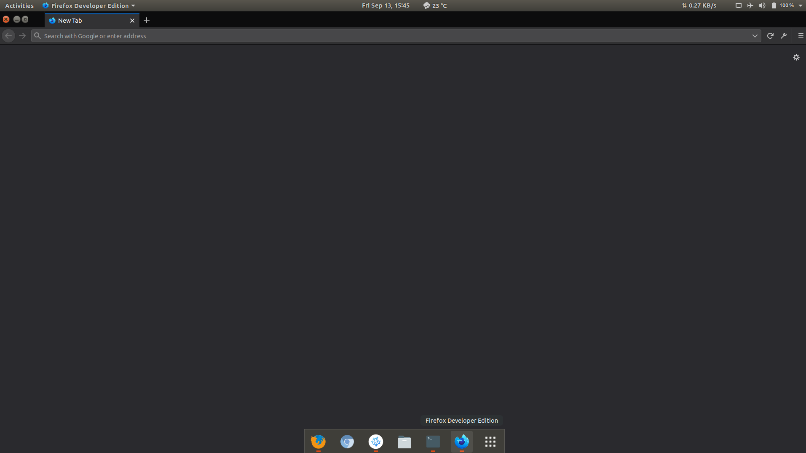

On Unix based operating systems installation packages or softwares are available in various formats, for example distribution specific packages comes in auto-installer formats like `.deb`, `.rpm`, `.pkg` etc. Sometimes the source code of a package comes in `.zip` files that has to be extracted, built, configured and installed. `AppImage` has also become a popular way to share applications. But a common way to ship softwares to the linux desktop environments has been via `tarballs`.

In this document we will see how to install `.tar` and `.tar.bz` package formats in debian/ubuntu. The procedure is same for other distribution as well. Before you start installing, you should understand few terms related to softwares. To demonstrate I will use [Firefox Developer Edition](https://www.mozilla.org/en-US/firefox/developer/) `.tar.bz2` package.

## Related Terms

#### Binaries
These are compiled files that are executed by the operating system. When you start a program, say text editor like VSCode, the vscode binary is executed which is located somewhere in `/usr/local/bin` directory. In many cases you get these binaries along with other files like assets including icons, configurations, dependencies etc. in a compressed directory such as `.tar`, `.zip`, `.tar.bz` or `.7z`. Binary files are often extension less or use `.bin` extension.

#### Source Code
Source Code are the program files that software developer write to build or create software. To create a software, the programs are first written and then compiled to build binaries that can be executed on our machines. Software vendors ship the entire source code instead of pre-built binaries. This has been a common way to share software since the envolution of software packages on computers. 

#### PATH
When we ask our operating system to execute a software or binary by double-clicking app icon or by using shell, OS search for the same application in a defined set of directory list(including the directory from which it was executed) called PATH. OS binaries are kept in `/usr/bin` and `/bin` directories and user binaries in `/usr/local/bin` but we can also append extra directories to the `PATH` list. When you install a package with an auto-installer, sometimes it automatically update PATH to include software packages, such procedure can also be used by crackers to install malicious softwares.

#### Linking
Linking a software to other location is similar to call-forwarding. When an application is executed, OS first search for it in the `PATH` directories. It might be possible that package directory containing binaries and assets of the application is not to be found in `PATH`, so we have two options here, either to update `PATH` to include our package directory or link our application to one of the existing `PATH` directories. When OS hit one of those directories looking for our package, it is forwarded to the actual directory when binaries and assets for application exist.

#### Permissions
OS is made up of files and processes. Each file has permission bits on them that restrict or allow users to read, write and execute them. In a typical unix environment, `root` or `sudo` user can perform read, write and execution on any file on the system. However, permissions need to be explicitly set for other users. Software binaries cannot be executed by users if execution permission is not set for them.


## Installing

[Download](https://www.mozilla.org/en-US/firefox/developer/) from Mozilla's website and extract the package. Extraction can be done by right clicking on the `.tar.bz2` file and selecting `Extract here`. 



Open the `Terminal` application. On Ubuntu this can be done by hitting **CTRL**+**ALT**+**T**. 

>For the sake of this tutorial I am assuming you have extracted the package in Downloads folder. If not, replace **Downloads** with the name of your directory in subsequent steps.

Move into the `Downloads` directory. Here you will find the extracted folder name similar to `firefox-7x.0x`, inside this folder is another folder named `firefox`. Lets rename this to `firefox-dev`.

```bash
$ mv ~/Downloads/firefox-70.05b/firefox ~/Downloads/firefox-70.05b/firefox-dev
```

Now, we first have to move `firefox-dev` folder to a permanent location in the system which is suitable for universal packages like this. Although we can run firefox from the Downloads directory, we must store it in a location were it is protected from accidental deletion. On linux, such pakages are kept in `/opt` directory. Since it is a root directory, it is also available to other users.

```bash
$ sudo mv ~/Downloads/firefox-70.05b/firefox-dev /opt/
```

Every package in `/opt` directory are bundles containing assets, binary files and dependencies and they are not included in `PATH` list, so this means that if we try to run `firefox-dev` from the shell, it will produce and error `command not found`. Hence an easy solution is to link firefox binary from this directory to a linker in a directory which already exist in PATH. For example, `/usr/local/bin` directory is the default directory where all the user binaries are stored. We will use this to link our firefox application.

A linker will create a link in this directory named `firefox-dev`, when OS find this linker, it will be forwarded to the original package directory.

```bash
$ sudo ln -s /opt/firefox-dev/firefox /usr/local/bin/firefox-dev
```

OS will now be able to successfully locate `firefox-dev` in the system, however we still won't be able to use it. This is because we still haven't set `execution` permission for current user. 

```bash
$ chmod +x /opt/firefox-dev/firefox
```

Finally you will be able to execute firefox-dev from the terminal, try yourself first before proceeding.

```bash
$ firefox-dev
```

## App Icon

Even though firefox is running via shell, we cannot find the application listed in menu or desktop. This step shows how we can create an application icon for Firefox Developer Web Browser.

Move to the terminal again and create a Desktop shortcut file. This file contains information that desktop environments use to create a menu entry. It is a simple text file with variables like name, icon, labels etc.

```bash
$ sudo nano /usr/share/applications/firefox-dev.desktop
```

`nano` is a text editor that will open this file for you right in the terminal. Copy-Paste following information into the editor.

```
[Desktop Entry]
Name=Firefox Developer
GenericName=Firefox Developer Edition
Exec=/usr/local/bin/firefox-dev
Terminal=false
Icon=/opt/firefox-dev/browser/chrome/icons/default/default48.png
Type=Application
Categories=Application;Network;X-Developer;
Comment=Firefox Developer Edition Web Browser
```

Now save this file by hitting **CTRL**+**X**, and pressing **Y** on the prompt.

Just like the binary, we also need to update permission for this file as well.

```bash
sudo chmod +x /usr/share/applications/firefox-dev.desktop
```

Congratulations 🎉, you have manually installed a package on your system! You will now be able to find firefox icon in menu.



## Common Procedure

To install packages similar to firefox's `.tar.bz2` first copy the extracted directory to a suitable location, link the binaries and set the permissions. If package have icons, we can then create a desktop entry in `usr/share/applications` directory. Sometimes you might need to rename binaries to resolve conflicts caused by existing packages with same name.